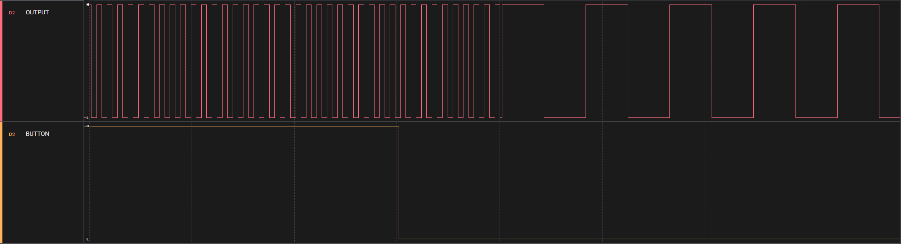

<a href="https://www.microchip.com">
    <picture>
        <source media="(prefers-color-scheme: light)" srcset="images/microchip-light.png">
        <source media="(prefers-color-scheme: dark)" srcset="images/microchip-dark.png">
        
    </picture>
</a>

# Getting Started With Multiple Configurations for the Configurable Logic Block (CLB) – Use Case for the PIC16F13145 Microcontroller with MCC Melody

The PIC16F13145 device family of microcontrollers is equipped with a Configurable Logic Block (CLB) peripheral. The CLB is a collection of logic elements that can be programmed to perform a wide variety of digital logic functions. The logic function may be completely combinatorial, sequential or a combination of the two, enabling users to incorporate hardware-based custom logic into their applications. This peripheral presents a unique way of modifying its control registers and setting up the logic elements. The CLB module consists of two sets of register interfaces: the standard Special Function Register (SFR) interface and a Configuration Interface. These SFRs allow user software the ability to enable/disable the module, program input bits into the CLB memory, select a clock source, read the outputs of each Basic Logic Element (BLE) and enable Peripheral Pin Select (PPS) outputs for specific BLE outputs.

The CLB’s logic elements cannot be configured using the SFR interface and consequently the Configuration Interface must be used for a complete configuration of the module. The Configuration Interface does not appear as an SFR in the Register Map and is not directly user-accessible. Instead, the Configuration Interface is accessed through the Nonvolatile Memory Control (NVM) Scanner module. Therefore, the configuration values for the combinational logic elements, also called the bitstream, must reside in Program Flash Memory (PFM) and the NVM Scanner transfers the information from the PFM into the CLB configuration area. Storing the bitstream in the Program Flash Memory offers extensive flexibility for a wide range of applications due to the fact that the user can store multiple bitstreams in memory which can be loaded into the CLB registers at run-time.

This code example shows how to change the bitstream at run-time and will reconfigure the CLB every time the on-board button is pressed.

## Related Documentation

- [PIC16F13145 Product Family](https://www.microchip.com/en-us/products/microcontrollers-and-microprocessors/8-bit-mcus/pic-mcus/pic16f13145?utm_source=GitHub&utm_medium=TextLink&utm_campaign=MCU8_MMTCha_PIC16F13145&utm_content=pic16f13145-multiple-clb-configurations-mplab-mcc-github&utm_bu=MCU08)
- [PIC16F13145 Product Page](https://www.microchip.com/en-us/product/PIC16F13145?utm_source=GitHub&utm_medium=TextLink&utm_campaign=MCU8_MMTCha_PIC16F13145&utm_content=pic16f13145-multiple-clb-configurations-mplab-mcc-github&utm_bu=MCU08)
- [PIC16F13145 Data Sheet](https://ww1.microchip.com/downloads/aemDocuments/documents/MCU08/ProductDocuments/DataSheets/PIC16F13145-Family-Microcontroller-Data-Sheet-DS40002519.pdf)
- [PIC16F13145 Curiosity Nano](https://www.microchip.com/en-us/development-tool/EV06M52A?utm_source=GitHub&utm_medium=TextLink&utm_campaign=MCU8_MMTCha_PIC16F13145&utm_content=pic16f13145-multiple-clb-configurations-mplab-mcc-github&utm_bu=MCU08)
- [PIC16F13145 Code Examples on Discover](https://mplab-discover.microchip.com/v2?dsl=PIC16F13145)
- [PIC16F13145 Code Examples on GitHub](https://github.com/orgs/microchip-pic-avr-examples/repositories?q=pic16f13145&type=all)

## Software Used

- [MPLAB® X IDE v6.20 or newer](https://www.microchip.com/en-us/tools-resources/develop/mplab-x-ide?utm_source=GitHub&utm_medium=TextLink&utm_campaign=MCU8_MMTCha_PIC16F13145&utm_content=pic16f13145-multiple-clb-configurations-mplab-mcc-github&utm_bu=MCU08)
- [MPLAB XC8 v2.50 or newer](https://www.microchip.com/en-us/tools-resources/develop/mplab-xc-compilers?utm_source=GitHub&utm_medium=TextLink&utm_campaign=MCU8_MMTCha_PIC16F13145&utm_content=pic16f13145-multiple-clb-configurations-mplab-mcc-github&utm_bu=MCU08)
- [PIC16F1xxxx_DFP Device Family Pack v1.25.389 or newer](https://packs.download.microchip.com/)

## Hardware Used

The [PIC16F13145 Curiosity Nano](https://www.microchip.com/en-us/development-tool/EV06M52A?utm_source=GitHub&utm_medium=TextLink&utm_campaign=MCU8_MMTCha_PIC16F13145&utm_content=pic16f13145-multiple-clb-configurations-mplab-mcc-github&utm_bu=MCU08) Development board is used as a test platform:

<picture>
    
</picture>

## Operation

To program the Curiosity Nano board with this MPLAB X project, follow the steps provided in the [How to Program the Curiosity Nano Board](#how-to-program-the-curiosity-nano-board) chapter.

## Concept

This application showcases the capabilities of using multiple configurations for the CLB module by creating two different versions of a simple clock divider circuit, as illustrated in the diagram below and accessible in the design [file](assets/design.clb). To keep things simple, the two circuits are identical, with the exception of the clock divider value. The first configuration divides the clock by 2 × 16 = 32, while the second configuration divides the clock by 2 × 128 = 256, and therefore the two digital circuits generate a 1 kHz and 125 Hz 50% duty cycle Pulse-Width Modulation (PWM) signal, respectively. The two configurations are stored in the Program Flash Memory and are loaded into the CLB registers at run-time. The change between the two configurations is initiated by the press of the on-board button of the Curiosity Nano.

<picture>
    
</picture>

### Generating Configurations

The first step is to create a project using the MCC Melody plug-in in MPLAB X IDE. In MCC, the CLB Module provides a Graphical User Interface (GUI) called the CLB Synthesizer which easies the design of digital logic circuits and the configuration of the logic elements, being an essential tool by allowing users to focus on the intended functionality of their logic design without having to fully understand the inner workings of the peripheral itself. The GUI offers the possibility to the user to create both schematic-centered digital designs and defining modules in the Verilog Hardware Description Language (HDL).

After the project has been created and the source code files have been generated by the MCC, the file of interest is the assembly one that contains the bitstream and some other configurations, called [`clbBitstream.s`](pic16f13145-multiple-clb-configurations-mplab-mcc.X/mcc_generated_files/clb/src/clbBitstream.s). At the top, the assembly file defines two labels, `_start_clb_config` and `_end_clb_config`, that demarcate the start and end, respectively, of the sequence of data words that make up the bitstream. They are also marked as `GLOBAL` so they can be referenced in the C source code. Additionally, a Program Section is defined using the `PSECT` directive and has its flags properly set so that the bitstream values are correctly laid out in the Program Flash Memory by the linker.

### Creating Multiple Bitstreams

The main point of this example is showing the changes that must be made to the bitstream assembly file so that multiple ones can be generated using MCC. Firstly, the file has to be renamed from `clbBitstream.s` to some other name such that the MCC wouldn’t overwrite its contents. For the source code used in this application, the simple scheme of adding "alt" (i.e., alternate) as a suffix to the filename was sufficient, due to the fact that the example will explore switching between two configurations. Hence, the filename in the example becomes [`clbBitstreamAlt.s`](pic16f13145-multiple-clb-configurations-mplab-mcc.X/mcc_generated_files/clb/src/clbBitstreamAlt.s). For a project in need of more than two configurations, the most convenient and efficient approach would be to suffix the filename with sequentially increasing values starting from 0 or 1.

After the file has been renamed, the labels that delimit the sequence of data words and the name of the Program Section have to be changed so that they are unique for every bitstream assembly file, as demonstrated in the diagram below. Finally, the user can implement a new digital design, synthesize it and generate a new bitstream file through the MCC. The process can be reiterated however many times it is needed to create the required number of bitstream files.

<picture>
    
</picture>

### Additional MCC Configurations

The CLB Module in the MCC also features some supplementary configurations to control the generation and loading of the bitstream file. By default, the MCC generates source code that loads the synthesized bitstream into the CLB registers and enables the module at start-up during the system initialization step. This is counter-intuitive in the context of multiple configurations because the user may want to load a specific configuration at start-up instead of the last generated one (if its default labels weren’t changed) and enable the CLB manually. This behavior may be turned off by disabling the _Load CLB Bitstream After Reset_ and _Enable CLB_ options in the CLB Module.

<picture>
    
</picture>

The other important and useful configuration is the possibility of setting the starting address in Program Flash Memory where the bitstream would reside. This behavior can be turned on by enabling the _Configurable Bitstream Address_ option in the CLB Module and inputing the desired value in the now available field, as long as its within the displayed constraints. Additional directives and Program Section flags are generated in order to have the bitstream values laid out in memory at the specified address. The generated preprocessor macro (`CLB_CONFIG_ADDRESS`) may also be renamed along with the other labels to maintain consistency by using the same naming scheme, but this is not mandatory since the define is local to every assembly file. Thus, the configuration for a fixed address can be enabled or disabled at will for each configuration, in case a predefined memory address is needed or not.

### Software Limitations

The CLB peripheral uses the Peripheral Pin Select (PPS) module to control external output pins. Consequently this aspect imposes further considerations during the development process due to the fact that the RxyPPS registers associated to used output pins in the design might need to be reconfigured for every loaded bitstream configuration. This stems from both in that the RxyPPS registers are cleared only by Power-on Reset and the fact MCC is going to initialize the RxyPPS with values only for the latest generated digital circuit configuration. Therefore, the user application must properly configure the RxyPPS registers if different pins are used by the CLB module when the configuration is changed (not the case for this example). Moreover, if a pin becomes General Purpose Input/Output (GPIO) when the CLB configuration is replaced, the user application must clear the corresponding RxyPPS register in software (RxyPPS = 0x00). For further information on how to properly configure the RxyPPS registers, refer to the [PIC16F13145 Data Sheet](https://ww1.microchip.com/downloads/aemDocuments/documents/MCU08/ProductDocuments/DataSheets/PIC16F13145-Family-Microcontroller-Data-Sheet-DS40002519.pdf). Another important aspect to be considered is that the Cyclic Redundancy Check (CRC) module can not be used during bitstream updates because both the CRC and CLB share the same NVM Scanner module.

## Software Implementation

Following the creation of the MCC project and the generation of the two bitstream files, multiple functions related to the application goal are defined. The primary function in the implementation is defined as highlighted below and its purpose is to effectively change the configuration in the CLB registers by passing as its parameter the bitstream address in Program Flash Memory. The CLB peripheral must be disabled previous to the bitstream transfer process and re-enabled afterwards.

```c
void ChangeConfiguration(uint16_t const startAddress)
{
    CLB1_Disable();
    CLB1_Configure(startAddress);
    CLB1_Enable();

    return;
}
```

In the next part of the application, as featured below, a static array is used as the storage method of choice for the bitstream addresses and the function `InitializeConfigurations` is the way to properly initialize this array. This function is called at runtime before the main logic loop. The `SetCurrentConfiguration` function has the purpose of setting the current CLB configuration and cycling to next one available in the array.

```c
#define NUMBER_OF_CONFIGS    ( 2 )

static uint16_t configurations[NUMBER_OF_CONFIGS] = { 0 };
```

```c
extern uint16_t start_clb_config;
extern uint16_t start_clb_config_alt;
```

```c
void InitializeConfigurations(void)
{
    configurations[0] = (uint16_t) &start_clb_config;
    configurations[1] = (uint16_t) &start_clb_config_alt;

    return;
}
```

```c
void SetCurrentConfiguration(void)
{
    static uint8_t currentConfigIdx = 0;

    ChangeConfiguration(configurations[currentConfigIdx]);

    currentConfigIdx = (currentConfigIdx + 1) % NUMBER_OF_CONFIGS;

    return;
}
```

## Setup

- **Clock Control**
  - Clock Source: HFINTOSC
  - HF Internal Clock: 32 MHz
  - Clock Divider: 1

<picture>
    
</picture>

---

- **Configuration Bits**
  - External Oscillator Mode Selection: Oscillator not enabled
  - Power-up Default Value for COSC: HFINTOSC (32 MHz)
  - Brown-out Reset: Disabled
  - Watchdog Timer: Disabled
  - Default values for the rest of the bits

<picture>
    
</picture>

---

- **CLB1**
  - Disabled
  - Clock Selection: MFINTOSC (32 kHz)
  - Clock Divider: 16 (Primary Configuration)/128 (Alternate Configuration)
  - Configurable Bitstream Address: Disabled
  - Load CLB Bitstream after Reset: Disabled

<picture>
    
</picture>

---

- **GPIO**
  - RA5 (`OUTPUT`) - Digital Output (CLBPPSOUT0)
  - RC3 (`BUTTON`) - Digital Input with Pullup Enabled (GPIO)

<picture>
    
</picture>

<picture>
    
</picture>

## Demo

The subsequent illustration presents the output signal from the CLB module, which is a PWM waveform operating at a 50% duty cycle. This diagram emphasizes the shift between the two configurations, specifically from 1 kHz to 125 Hz, a change that is initiated by the simple press of the button.

<picture>
    
</picture>

To have a general idea about the timing constraints, the configuration change delay has been measured by registering the time elapsed between the button press and the waveform frequency shift. For this measurement, the button debounce delay has been removed to obtain a more accurate and precise result. As outlined in the figure below, the configuration change delay has a value of approximattely 60 µs.

<picture>
    
</picture>

## Summary

This application demonstrates the possibility of using multiple configurations on the Configurable Logic Block of the PIC16F13145 device family. The provided code example illustrates a straightforward scenario in which the configurations are alternated in a cyclical manner upon the press of a button.

## How to Program the Curiosity Nano board

This chapter shows how to use the MPLAB X IDE to program a PIC® device with an `ExampleProject.X`. This can be applied for any other projects.

1. Connect the board to the computer.

2. Open the `ExampleProject.X` project in MPLAB X IDE.

3. Set the ExampleProject project as main project.

   Right click the project in the **Projects** tab and click Set as Main Project.

   

4. Clean and build the ExampleProject project.

   Right click on the ExampleProject project and select Clean and Build.

   

5. Select the PIC Curiosity Nano in the Connected Hardware Tool section of the project settings:

   - Right click on the project and click Properties
   - Click on the arrow under the Connected Hardware Tool
   - Select the PIC Curiosity Nano, click **Apply** and then click **OK**:

   

6. Program the project to the board.

   Right click the project and click Make and Program Device.

   

## Contents

- [Back to Related Documentation](#related-documentation)
- [Back to Software Used](#software-used)
- [Back to Hardware Used](#hardware-used)
- [Back to Operation](#operation)
- [Back to Setup](#setup)
- [Back to Summary](#summary)
- [Back to How to Program the Curiosity Nano board](#how-to-program-the-curiosity-nano-board)
- [Back to Top](#getting-started-with-multiple-configurations-for-the-configurable-logic-block-clb-–-use-case-for-the-pic16f13145-microcontroller-with-mcc-melody)
